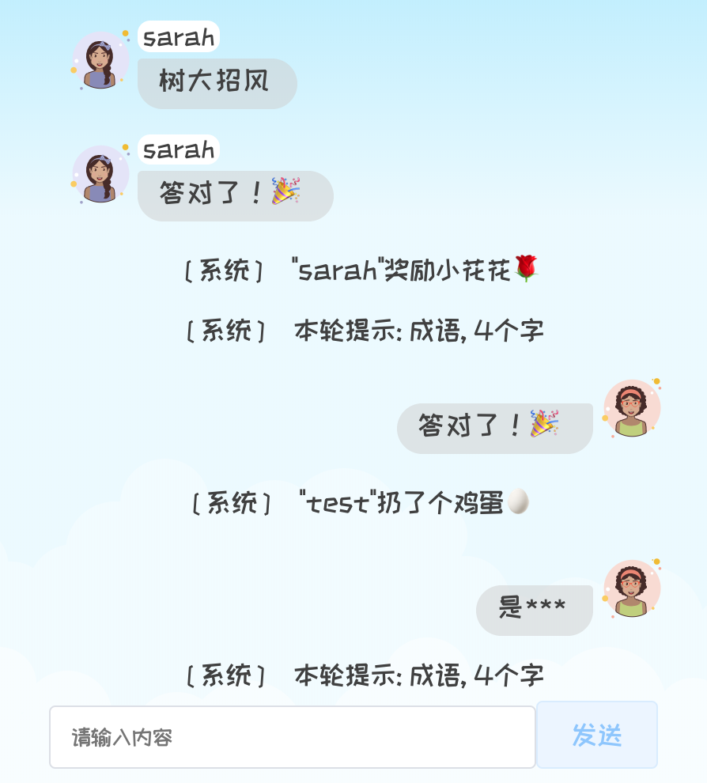
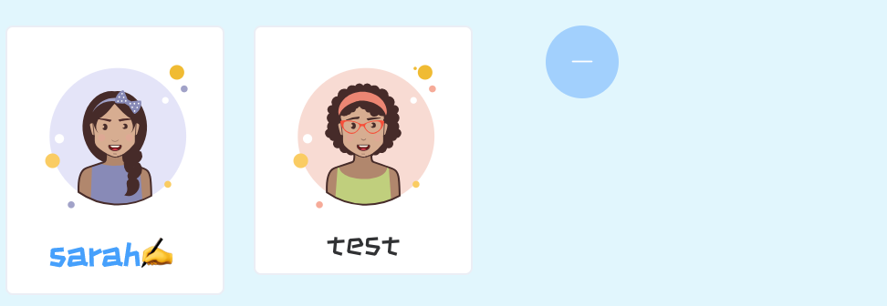
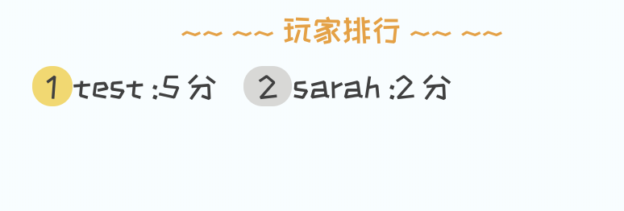
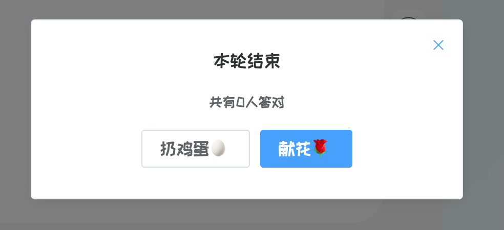
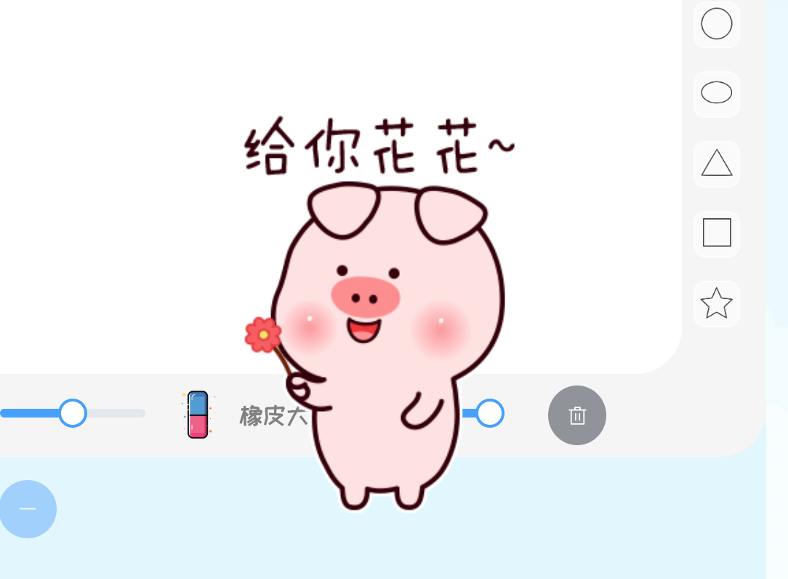
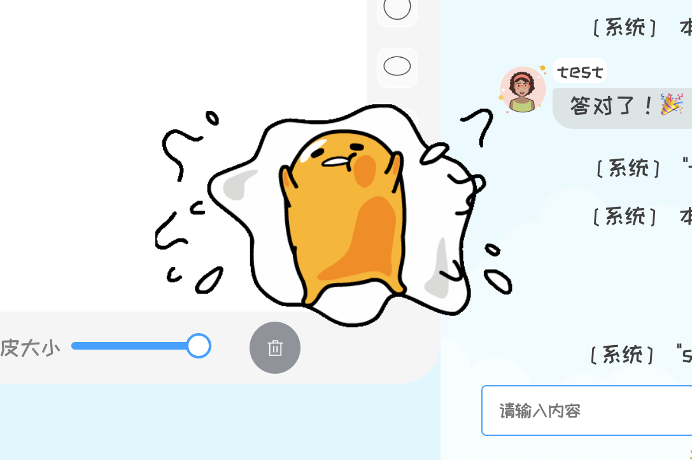
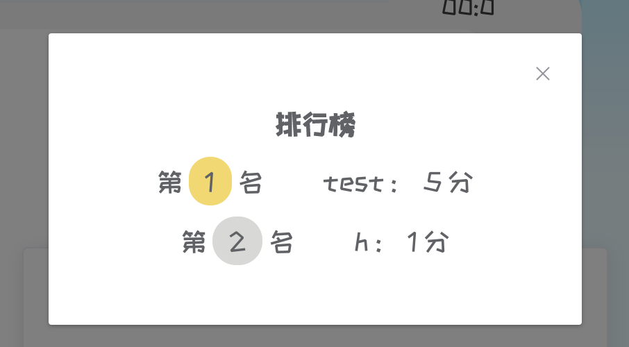

# draw-and-guess

[Course Project] 你画我猜


## 项目架构

### 前端

- `Vue` 
  - `Vue Router`
  - `Vuex`
- 主要使用的库：
  - `Element-UI` 
  - `anime.js` 
  - `SVG.js` 
  - `axios` 
  - `stomp.js` & `sockjs` 

##### 代码结构

```
.
├── App.vue
├── components
│   ├── Chat.vue
│   ├── DrawingBoard.vue
│   ├── GIF.vue
│   ├── Ready.vue
│   ├── ShowDrawer.vue
│   └── Users.vue
├── main.js
├── router.js
├── store.js
└── views
    ├── Enter.vue
    ├── Room.vue
    └── Square.vue
```


### 后端

- `Spring Boot` 
- `MongoDB` 

##### 代码结构

```
.
├── DrawApplication.java
├── config
│   ├── CorsConfig.java
│   ├── GlobalExceptionHandler.java
│   └── WebSocketConfig.java
├── controller
│   ├── PuzzleController.java
│   ├── RoomController.java
│   ├── UserController.java
│   └── WsController.java
├── dao
│   ├── CurrentRepository.java
│   ├── PuzzleRepository.java
│   ├── RoomRepository.java
│   └── UserRepository.java
└── utility
    ├── ErrorMessage.java
    └── model
        ├── Current.java
        ├── Puzzle.java
        ├── Room.java
        └── User.java
```


## 主要界面与实现

### 1. 开始界面

- 支持登录、注册、游客登录、选择头像
- 输入验证


### 2. 游戏大厅

- 搜索房间 - 通过房间ID、房间名

- 创建房间

- 进入房间
  - 满6人不可进入
  - 游戏已开始不可进入
  - 一个人只能加入一个房间，加入第二个房间会自动退出第一个房间
- 退出登录（游客账号退出后不可再登录）


### 3. 房间


#### 3.1 画板

- 仅游戏已开始且本轮负责画画的玩家操作画板有效
- 支持画笔、橡皮、改变颜色、改变线条粗细、清空画板
- 支持图形、可选是否填充

##### 实现

- 画笔 & 橡皮：用websocket不断传送画笔的数据
- 图形：玩家拖拽时改变svg图形的形状大小，鼠标释放后再将图形"画"到画布上


#### 3.2 聊天区

- 模拟一般的聊天界面
- 作画的人不可以发消息
- 第一次答对显示 `答对了!🎉` ，之后都会用 `***` 屏蔽答案
- 会显示系统发送的信息




#### 3.3 游戏数据展示

##### 实现

- 游戏数据实时更新：数据更新时，后端通过websocket推送最新的游戏数据，前端接收后把数据存到本地缓存的store中(`Vuex`)，各个组件监控store内数据，一旦数据发生变化即更新展示在界面上的数据

- 谜题展示 - 画者 & 猜者


- 玩家展示 - "排队"轮流作画



- 实时分数排行



- 玩家评价 - 献花 & 扔鸡蛋
  - 实现：随机生成展示位置







- （游戏结束）排行榜


