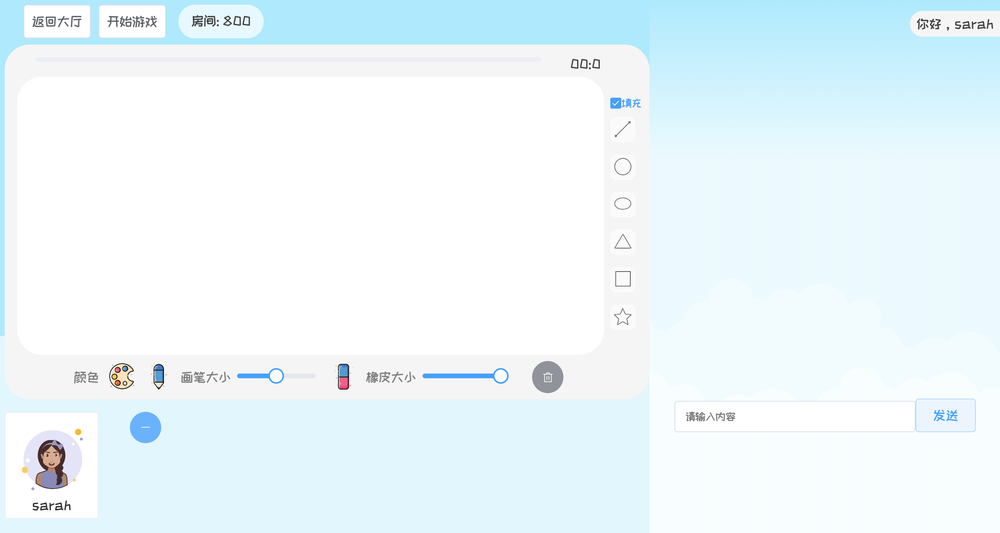

# draw-and-guess

[Course Project] 你画我猜

> 吴桐欣 1652677

## 项目架构

### 前端

- `Vue-Cli` - 框架
- 主要使用的库：
  - `Element-UI` - 组件库
  - `anime.js` - 制作动画
  - `SVG.js` - 操作svg元素
  - `axios` - 请求后端数据
  - `stomp.js` & `sockjs` - websocket

##### 代码结构

### 后端

- `Spring Boot` - 框架
- `MongoDB` - 数据库

##### 代码结构

## 主要界面与实现

### 1. 开始界面

- 支持登录、注册、游客登录、选择头像
- 输入验证

### 2. 游戏大厅

- 搜索房间 - 通过房间ID、房间名

- 创建房间

- 进入房间
  - 满6人不可进入
  - 游戏已开始不可进入
- 退出登录（注销）

### 3. 房间

#### 3.1 画板

- 仅游戏已开始且本轮负责画画的玩家操作画板有效
- 支持画笔、橡皮、改变颜色、改变线条粗细、清空画板
- 支持图形、可选是否填充

##### 实现

- 画笔 & 橡皮：用websocket不断传送画笔的数据
- 图形：玩家拖拽时改变svg图形的形状大小，鼠标释放后再将图形"画"到画布上

#### 3.2 聊天区

#### 3.3 游戏数据展示